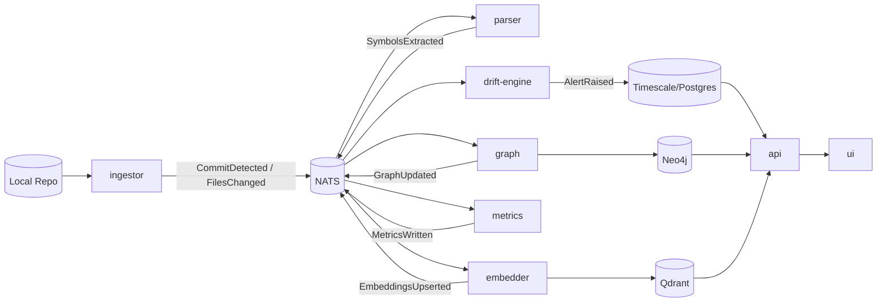

# DriftCube

AI code observability for drift detection across architecture, semantics, and complexity.

DriftCube watches repositories, extracts symbols, builds a graph model, indexes semantic fingerprints, computes drift metrics, and raises explainable alerts for AI-assisted code decay.

## Why DriftCube

- Detects meaningful code drift before it becomes production risk.
- Correlates graph structure, vector similarity, and metrics in one pipeline.
- Produces explainable alerts instead of opaque scores.

## System Architecture



## Tech Stack

| Layer | Technology |
| --- | --- |
| Messaging | NATS JetStream |
| Graph store | Neo4j |
| Vector store | Qdrant |
| Time-series + relational | Timescale/Postgres |
| Cache | Redis |
| Object store | MinIO |
| API | Fastify (Node.js/TypeScript) |
| UI | Next.js |
| Orchestration | Docker Compose |

## Monorepo Layout

| Path | Responsibility |
| --- | --- |
| `packages/ingestor` | Filesystem watcher and change event producer |
| `packages/parser` | TypeScript/Python symbol extraction and normalization |
| `packages/graph` | Neo4j upserts for files, modules, symbols, imports, and calls |
| `packages/embedder` | Deterministic hashed vector embeddings into Qdrant |
| `packages/metrics` | Complexity/smell/risk metrics into Timescale |
| `packages/drift-engine` | Drift rules and explainable alert generation |
| `packages/api` | API for repos, commits, components, alerts, and search |
| `packages/ui` | Dashboard for repo/component/commit observability |
| `migrations` | SQL and Cypher bootstrapping |
| `scripts` | Local bootstrap and demo utilities |

## Platform Features

### Available

- **Code Entropy Index (CEI)**: Composite metric for architectural disorder across dependencies, duplication, complexity variance, and volatility.
- **Architecture Pressure Mapping**: Predictive signal for structural stress, including coupling growth, boundary bending, and semantic duplication before visible drift.
- **Boundary Pressure Detection**: Edge-level monitoring of module boundaries (for example `domain -> web`) to detect early architecture erosion.
- **Alert Fingerprint Deduplication**: Hash-based suppression of repeated findings to keep alerts high signal.
- **Refactor Suggestion Engine**: Ranked, evidence-backed refactor plans (dedupe, module extraction, dependency inversion) with predicted impact.
- **AI Drift Detection**: Detection of AI-generated code risks including semantic clones, volatility, and style drift.
- **Fleet Architecture Telemetry**: Central command view aggregating entropy, pressure, and drift across repositories.
- **Live Codebase Observability Pipeline**: Continuous watcher -> parser -> graph -> embeddings -> metrics -> drift engine flow, rather than periodic scans.
- **Graph + Semantic Hybrid Analysis**: Joint analysis using Neo4j dependency graphs plus Qdrant embedding similarity.

### Planned

- **Architecture Memory**: Store historical architecture signatures to learn what healthy looked like and detect deviations automatically.
- **Architecture Similarity Search**: Find modules or repositories with similar structural and semantic patterns to reuse proven fixes.
- **Impact Simulation**: Estimate how proposed refactors change entropy, pressure, and coupling before applying changes.

## Quick Start

### 1) Prerequisites

- Docker + Docker Compose
- Node.js + npm

### 2) Configure and seed

```bash
cp .env.example .env
./scripts/seed_demo_repo.sh
```

### 3) Boot infrastructure and apply migrations

```bash
./scripts/dev.sh
```

### 4) Start application services

```bash
docker compose up api ui ingestor parser graph embedder metrics drift-engine
```

### 5) Open the dashboard

- UI: `http://localhost:43000`
- API: `http://localhost:48080`

## Local Service Ports (Default)

| Service | Port |
| --- | --- |
| UI | `43000` |
| API | `48080` |
| NATS | `46222` |
| NATS monitor | `46282` |
| Timescale/Postgres | `45432` |
| Neo4j HTTP | `47474` |
| Neo4j Bolt | `47687` |
| Qdrant HTTP | `46333` |
| Qdrant gRPC | `46334` |
| Redis | `46379` |
| MinIO API | `49000` |
| MinIO Console | `49001` |

## Current v1 Coverage

- Near real-time local repository watching.
- TypeScript and Python symbol extraction.
- Graph + vector + metric updates across service boundaries.
- Explainable alerts for:
  - semantic duplication
  - complexity creep
  - architecture violations
  - intent drift
  - volatility hotspots

## Implementation Notes

- Embeddings are deterministic hashed vectors in v1 (not model embeddings yet).
- Architecture policies currently assume `src/domain`, `src/web`, and `src/infra`.
- Local watcher events currently emit synthetic commit IDs.
- MinIO is provisioned; deep object integration is still in progress.

## Roadmap

1. Replace hashed vectors with production embeddings.
2. Move architecture policy rules into configurable gates.
3. Add IDE provenance tagging for agent-generated changes.
4. Add remote git ingestion and webhook support.
